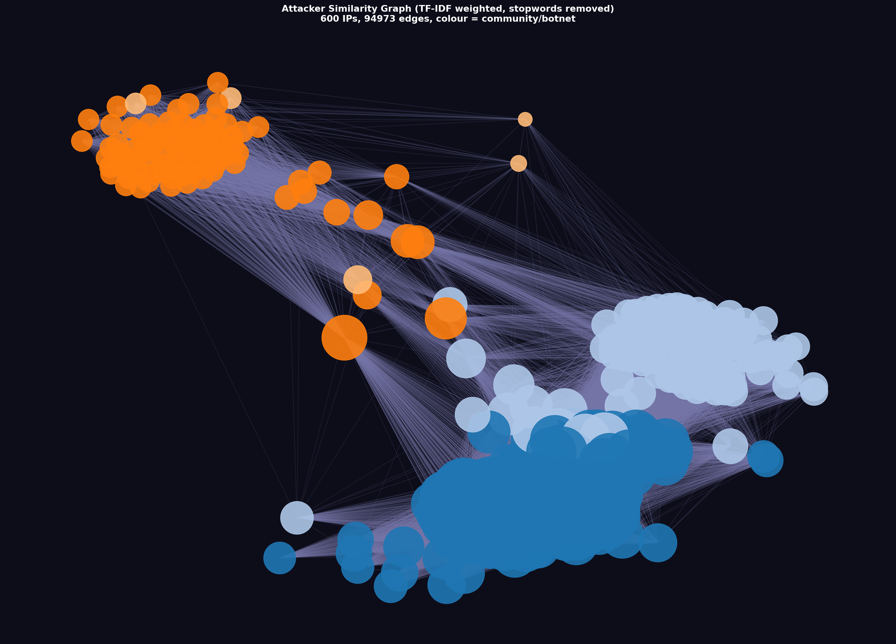

# Honeypot Attacker Clustering — Technical Report
Version 4 : TF-IDF with Stopword Removal + Leiden Community Detection

| | |
|---|---|
| **Institution** | FORTH / C-SOC |
| **Honeypot** | Cowrie SSH (port 22) |
| **Data file** | `cowrie_ip_username_pass_anon.csv` |
| **Analysis date** | June 2026 |
| **Stack** | Python 3 · `networkx` · `scipy.sparse` · `leidenalg` · `igraph` · `matplotlib` |

---

## 1. Dataset

| Metric | Value |
|---|---|
| Total login attempts | 268,875 |
| Unique attacker IPs | 4,973 |
| Unique credential pairs | 40,474 |
| Pairs shared by more than one IP | 25,149 (62%) |

62% of credential pairs appear across multiple IPs, which is what makes clustering feasible. Bots in the same botnet tend to share the same credential dictionary, so shared pairs are the main signal we can use to group them.

---

## 2. Method

### Hypothesis
Two IPs sharing many of the same credential pairs are probably part of the same botnet. The rarer those shared credentials, the stronger that inference.

### Pipeline

| Step | Operation |
|---|---|
| 1 | Load CSV → list of `(ip, username, password)` triples |
| 2 | Build `pair → IPs` and `IP → pairs` mappings (sets, so retries don't inflate counts) |
| 3 | Filter vocabulary: drop credentials used by >10% of all IPs (stopwords) or by exactly 1 IP (singletons) |
| 4 | Compute IDF per surviving credential pair: `IDF = log(N / df)` |
| 5 | Build sparse TF-IDF matrix over kept pairs; L2-normalise rows; compute cosine similarities |
| 6 | Add edge between two IPs if cosine similarity >= 0.10 |
| 7 | Run Leiden community detection (plain modularity, `seed=42`) |
| 8 | Extract signature credential per cluster (most-shared kept pair, IDF tiebreak) |
| 9 | Visualise and export |

### IDF Weighting

Not all shared credentials are equally informative. A pair tried by half the dataset barely distinguishes one attacker from another. A pair tried by only seven IPs across the whole dataset is a much more specific link. IDF (Inverse Document Frequency) captures this by assigning each credential pair a weight based on how rare it is:

```
IDF(pair) = log( N / df )

N  = 4,973   (total unique IPs)
df = number of IPs that tried this pair
```

| Credential pair | IPs | IDF | Signal strength |
|---|---|---|---|
| `345gs5662d34/345gs5662d34` | 2,791 | 0.578 | Very low |
| `root/3245gs5662d34` | 1,658 | 1.098 | Low |
| `root/@qwer2025` | 799 | 1.828 | Low–medium |
| `admin/admin` | 452 | 2.398 | Medium |
| `root/root` | 272 | 2.906 | Medium |
| `root/debian` | 184 | 3.298 | Medium–high |
| `root/123456` | 131 | 3.634 | Medium–high |
| `OPTIONS sip:.../Via: SIP/2.0/...` | ~24 | ~5.3 | High |
| `perl/warning` | 7 | 6.563 | High |
| `eth/ethereum12345` | 3 | 7.413 | Very high |
| Any pair used by exactly 1 IP | 1 | 8.512 | Maximum |

Two IPs form an edge in the graph if their cosine similarity is at least 0.10. Since cosine similarity is length-normalised, this threshold is consistent regardless of how many credentials a given IP tried — a short list and a long list are compared on the same scale.

Before IDF is computed, two groups of credentials are removed from the vocabulary:

**Stopwords** (`df > 0.10 × N = 497`): credentials used by more than 10% of all IPs. Sharing them carries almost no useful signal. In V4, `345gs5662d34/345gs5662d34` (df=2,791) and `root/3245gs5662d34` (df=1,658) are both dropped.

**Singletons** (`df < 2`): credentials tried by only one IP. They can never appear in a shared pair and only distort similarity calculations by inflating vector norms.

After filtering, the minimum IDF among retained credentials rises to about 2.3, meaning every remaining pair has at least some discriminating value.


---

## 3. Results

### Version Comparison

| Metric | V1 | V2 | V3 | V4 |
|---|---|---|---|---|
| Edge weighting | Raw count | IDF sum | Cosine similarity | Cosine similarity |
| Vocabulary filter | None | None | None | Stopwords + singletons removed |
| Community algorithm | Louvain | Louvain | Leiden | Leiden (plain modularity) |
| Threshold | min shared pairs | IDF sum >= 1.0 | cosine sim >= 0.10 | cosine sim >= 0.10 |
| Largest cluster | 1,974 IPs | 856 IPs | 3,329 IPs | 3,367 IPs |
| Clusters >= 10 IPs | 6 | 13 | 9 | 10 |
| Clusters >= 2 IPs | 21 | 29 | 31 | 29 |
| Artificial mega-clusters | 3 | 0 | 0 | 0 (canary filtered from vocabulary) |
| Singletons | 159 | 159 | 224 | 186 |
| Total communities | 179 | 188 | 255 | 215 |

### Cluster Distribution (V4)

| Size | Count | Identity |
|---|---|---|
| 3,367 | 1 | Canary-adjacent botnet (ubuntu/3245gs5662d34) |
| 393 | 1 | Admin/Admin botnet |
| 379 | 1 | root/root botnet |
| 197 | 1 | Debian-targeting botnet |
| 161 | 1 | Unknown (signature: root/------fuck------) |
| 135 | 1 | HTTP/Chrome-UA scanner |
| 34 | 1 | root/Abcd1234 cluster |
| 25 | 1 | Go-http-client scanner |
| 24 | 1 | SIP/VoIP scanner |
| 17 | 1 | Raspberry Pi scanner (pi/raspberryraspberry993311) |
| 8 | 1 | TLS binary probe |
| 7 | 1 | Perl exploit tool |
| 7 | 1 | a/a cluster |
| 3 | 1 | Ethereum miner |
| 2 | 15 | Small pairs (crypto-miners, misc) |
| 1 | 186 | Singletons |
| **Total** | **215** | |

### Graph

600-node sample of the largest connected component. Colour = community.



---

## 4. Cluster Analysis

**Community 0 — Canary-Adjacent Botnet (3,367 IPs)**
Signature: `ubuntu/3245gs5662d34`. The largest cluster in the dataset. In V4, the two most common canary credentials (`345gs5662d34/345gs5662d34` and `root/3245gs5662d34`) are removed as stopwords, so the community is now identified by `ubuntu/3245gs5662d34`, a less frequent variant that survived filtering. The cluster is slightly larger than V3's 3,329 IPs, which shows that removing the stopwords didn't fragment the botnet — the remaining canary-family credentials are still enough to hold the group together. The canary string is a deliberate fingerprint inserted by the operator to identify their bots in honeypot logs. The scale and technique point to a professional threat actor.

---

**Community 1 — Admin/Admin Botnet (393 IPs)**
Signature: `admin/admin`. The credential list targets consumer routers, IP cameras, NAS devices, and single-board computers using factory-default credentials. This is consistent with Mirai-style IoT scanning.

---

**Community 2 — root/root Botnet (377 IPs)**
Signature: `root/root`. Targets Linux servers and embedded devices where the root account still has its default password. There is some overlap in target profile with the Debian-targeting cluster, but the credential lists are distinct.

---

**Community 3 — Debian-Targeting Botnet (196 IPs)**
Signature: `root/debian`. Targets Debian-based Linux systems with default root credentials — Debian, Ubuntu, Raspberry Pi OS.

---

**Communities 5 & 7 — HTTP/Go Scanner (135 + 25 IPs)**
In V4, the single HTTP/Go scanner community from V3 (160 IPs) splits into two distinct groups. Community 5 (135 IPs) uses a full Chrome-like User-Agent (`Mozilla/5.0 (Macintosh; Intel Mac OS X 13_1) AppleWebKit/537.36`), while Community 7 (25 IPs) uses only the bare `User-Agent: Go-http-client/1.1` header. Both groups send HTTP headers as SSH credentials — these are not brute-force tools but Go-based multi-protocol scanners probing port 22 for misconfigured HTTP servers or Redis instances. The stopword removal revealed the difference between the two tool variants, which a common credential had previously masked.

**Community 6 — root/Abcd1234 Cluster (34 IPs)**
Signature: `root/Abcd1234`. This cluster becomes visible in V4 after stopword removal. It targets Linux servers with a password that looks strong but follows a guessable pattern (capitalised word + digits + punctuation). The behaviour matches credential-stuffing tools operating from leaked-password dictionaries.

---

**Community 7 — SIP/VoIP Scanner (24 IPs)**
Signature: `OPTIONS sip:nm SIP/2.0` / `Via: SIP/2.0/TCP nm;branch=foo`. All 24 IPs send the same 7-line SIP OPTIONS request as their SSH credentials. The apparent target is VoIP PBX systems, most likely for toll fraud.

---

**Community 8 — Raspberry Pi Scanner (17 IPs)**
Signature: `pi/raspberryraspberry993311`. Targets Raspberry Pi devices that haven't changed the default `pi` user password. The doubled string (`raspberry` × 2 + digits) matches a known default credential from early Raspberry Pi OS images.

---

**Community 9 — TLS Binary Probe (8 IPs)**
Signature: Raw TLS ClientHello bytes (`\x16\x03\x03`). These IPs are probing port 22 for services accidentally running TLS — HTTPS, LDAPS, or similar.

---

**Community 10 — Perl Exploit Tool (7 IPs)**
Signature: `perl/warning` (IDF = 6.563). All 7 IPs try exactly this one pair. It is the fingerprint of a specific Perl-based exploit tool.

---

**Community 12 — Ethereum Miner (3 IPs)**
Signature: `eth/ethereum12345`. These IPs appear to be attempting to install Ethereum mining software on compromised servers.

---

**Small pairs — 18 clusters × 2 IPs**
Crypto-miner usernames (`xmr`, `bitcoin`, `eth`, `wallet`) and miscellaneous pairs. Monero is the most common mining target — its CPU-efficient RandomX algorithm and untraceable transactions make it a standard choice for illicit mining.

---

## 5. Threat Intelligence

The canary credential (`345gs5662d34`) appearing across 3,329 IPs is not coincidental. Inserting a recognisable string into a botnet's credential dictionary is a deliberate technique to fingerprint one's own fleet in honeypot logs. The scale of the operation rules out opportunistic actors.

Port 22 captured traffic that was never intended for SSH. HTTP scanners (160 IPs), SIP scanners (24 IPs), and TLS probers (8 IPs) all appear in the dataset because attackers routinely probe all open ports for any exploitable service, not just the one the port is nominally assigned to.

Crypto-mining is the dominant observed motive. At least 16 communities show explicit mining intent, and Monero is consistently preferred — its RandomX proof-of-work is CPU-friendly and its transactions are untraceable by design.

IoT default credentials dominate the largest clusters. `admin/admin`, `root/debian`, and `orangepi/orangepi` are all factory defaults on routers, cameras, and embedded devices, and the persistence of these attacks reflects how many such devices remain unpatched.

The 186 singleton IPs — those with no shared credentials — are not necessarily lone actors. They could be low-activity bots, operators deliberately using unique wordlists to defeat clustering, security researchers, or other honeypots.

---

## 6. Defensive Indicators

| Indicator | Action |
|---|---|
| SSH username or password = `345gs5662d34` | Block immediately — confirmed botnet traffic |
| SIP headers in SSH credentials | Block + alert — VoIP fraud scanner |
| `admin/admin`, `root/debian`, `orangepi/orangepi` | Enforce credential policy on all devices |
| Usernames `xmr`, `bitcoin`, `eth`, `wallet` | Alert — probable crypto-miner deployment |
| Go HTTP client User-Agent on port 22 | Block at firewall |

---

## 7. Next Steps

**GeoIP enrichment:** map sub-clusters geographically — are the canary sub-clusters from distinct regions?

**Timestamp analysis:** if available, correlate attack timing across clusters.

**Multi-honeypot correlation:** combining logs from multiple sensors dramatically improves cluster resolution.

---

## 8. Output Files

| File | Description |
|---|---|
| `cluster_attackers.py` | Analysis script (V3, cosine similarity + Leiden) |
| `cluster_results.csv` | Every IP with community ID, cluster size, signature credential |
| `attacker_graph.png` | Graph visualisation (600-node sample) |
| `cowrie_ip_username_pass_anon.csv` | Raw honeypot data |

---

## 9. Algorithm Deep Dive

### 9.0 Vocabulary Filtering: Stopword Removal (V4)

#### Why IDF alone is not enough

The two most common credentials in the dataset — `345gs5662d34/345gs5662d34` (used by 2,791 IPs) and `root/3245gs5662d34` (used by 1,658 IPs) — were pulling most of the dataset into one giant cluster regardless of what else each attacker was doing. IDF was supposed to handle this by giving those pairs very low weights, but it turned out that wasn't enough on its own.

The problem comes from L2 normalisation. After IDF scores are computed, each IP's vector is divided by its own magnitude to produce a unit-length vector. Cosine similarity between IPs $a$ and $b$ is then:

$$\cos(\hat{\mathbf{v}}_a, \hat{\mathbf{v}}_b) = \hat{\mathbf{v}}_a \cdot \hat{\mathbf{v}}_b$$

where $\hat{\mathbf{v}}_i = \mathbf{v}_i / \|\mathbf{v}_i\|$. The canary contributes $\text{IDF}(\text{canary}) = 0.578$ to its dimension in the raw vector, and $0.578^2 = 0.334$ to the squared norm $\|\mathbf{v}_i\|^2$. After normalisation, that dimension becomes:

$$\hat{v}_i[p_\text{canary}] = \frac{0.578}{\|\mathbf{v}_i\|}$$

For an IP whose credential profile is dominated by the canary, $\|\mathbf{v}_i\|$ is small and this fraction approaches 1. Two such IPs end up with cosine similarity near 1 even when the rest of their credential lists are completely different. The normalisation re-inflates the canary's influence, undoing what IDF tried to reduce.

The only way to fix this completely is to remove the canary from the vector space. Once the dimension doesn't exist, it can't appear in any cosine calculation.

#### The vocabulary filter

Two thresholds are applied before IDF is computed:

$$\text{keep pair } p \iff \text{MIN\_DF} \leq df_p \leq \lfloor\text{MAX\_DF\_FRACTION} \times N\rfloor$$

With $N = 4{,}973$, `MAX_DF_FRACTION = 0.10`, `MIN_DF = 2`:

| Threshold | Value | Drops |
|---|---|---|
| Upper bound | $df_p \leq 497$ | Credentials used by >10% of IPs (stopwords) |
| Lower bound | $df_p \geq 2$ | Credentials only one IP ever tried (singletons) |

Stopwords are credentials so widespread that sharing them carries no discriminating signal. The analogy to text search is direct: words like "the" or "is" appear in almost every document and get removed from the index before similarity is computed, because they're noise rather than signal. Three stopwords were identified in this dataset: `345gs5662d34/345gs5662d34` (df=2,791), `root/3245gs5662d34` (df=1,658), and `root/@qwer2025` (df=799).

Singletons appear in only one IP's vector. Their dot product with any other IP's vector is zero — they can never form an edge. What they do contribute is inflating the L2 norm of the single IP that tried them, which weakens that IP's cosine similarity with its genuine botnet peers. Removing them makes the remaining vector directions more meaningful.

#### IDF after filtering

IDF is computed only over credentials that survived both filters:

$$\text{IDF}(p) = \log\!\left(\frac{N}{df_p}\right), \quad 2 \leq df_p \leq 497$$

The minimum IDF in the filtered vocabulary is $\log(4973/497) \approx 2.30$. Every retained pair carries at least moderate discriminating power.

#### IPs with fully filtered credential sets

Some IPs used only stopwords and singletons. After filtering, their TF-IDF vectors are all zeros. To avoid dividing by zero during normalisation:

$$\text{inv}_i = \begin{cases} 1/\|\mathbf{v}_i\| & \text{if } \|\mathbf{v}_i\| > 0 \\ 0 & \text{otherwise} \end{cases}$$

A zero-norm row stays zero after normalisation. The IP's cosine with everyone else is 0, no edges are formed, and it becomes a singleton community. This is the right outcome: if an IP's only activity was trying universal credentials, we have no basis for assigning it to any specific botnet.

---

### 9.1 IDF: Measuring Credential Rarity

Two IPs both trying `345gs5662d34/345gs5662d34` (used by 56% of the dataset) tells us almost nothing. Two IPs both trying `perl/warning` (7 IPs total) is strong evidence they're running the same attack tool. The problem is turning this intuition into a number.

IDF does this by measuring how rare each credential pair is:

$$\text{IDF}(p) = \log\!\left(\frac{N}{df_p}\right)$$

where $N = 4{,}973$ is the total number of unique attacker IPs, and $df_p$ is how many of them tried pair $p$.

The logarithm is there for a practical reason. Without it, the scale becomes unworkable. The most common pair gives $N/df \approx 1.78$, while a moderately rare pair with $df = 50$ gives $N/df \approx 99.5$ — a 56× difference on a linear scale. A small number of semi-rare credentials would dominate every similarity calculation. The log compresses this range:

| Credential pair | $df$ | $N/df$ | IDF |
|---|---|---|---|
| `345gs5662d34/345gs5662d34` | 2791 | 1.78 | 0.578 |
| `admin/admin` | 452 | 11.0 | 2.398 |
| `root/debian` | 184 | 27.0 | 3.298 |
| `perl/warning` | 7 | 710.4 | 6.563 |
| any unique pair | 1 | 4973 | 8.512 |

There's also a useful boundary property: a pair used by every IP gets $\log(1) = 0$, meaning it contributes nothing to any similarity calculation. A pair used by exactly one IP gets the maximum value $\log(N)$. IDF values naturally fall in $[0, \log N]$ without any manual tuning.

---

### 9.2 TF-IDF Vectors

Each IP is represented as a sparse vector in a space with one dimension per credential pair — 40,474 dimensions total. The value in each dimension is the IDF score of that credential if the IP tried it, or zero otherwise:

$$\mathbf{v}_i[p] = \begin{cases} \text{IDF}(p) & \text{if IP}_i \text{ tried pair } p \\ 0 & \text{otherwise} \end{cases}$$

The term frequency (TF) component is binary: whether the IP tried a given pair at all. Retry counts are discarded. What identifies a botnet is which credentials were attempted, not how many connection attempts were logged — a high-volume bot and a low-volume bot running the same software should look identical to the clustering algorithm.

The vectors are very sparse. A typical IP tries 50–200 distinct credential pairs out of 40,474, meaning over 99% of each vector is zero. This sparsity is what makes the matrix computation in section 9.4 tractable.

Two IPs running the same attack software against the same wordlist will have nearly identical vectors. Two IPs from different botnets with completely different credential dictionaries will point in almost perpendicular directions in this high-dimensional space.

---

### 9.3 Cosine Similarity

Similarity between two IPs is measured as the cosine of the angle between their credential vectors:

$$\cos(\mathbf{v}_a, \mathbf{v}_b) = \frac{\mathbf{v}_a \cdot \mathbf{v}_b}{\|\mathbf{v}_a\| \cdot \|\mathbf{v}_b\|}$$

The geometric interpretation is straightforward. Two vectors span an angle $\theta$ between them. When $\theta = 0°$ the vectors point in the same direction — identical credential profiles — and $\cos\theta = 1$. When $\theta = 90°$ they're perpendicular — no credentials in common — and $\cos\theta = 0$.

Dividing by both magnitudes fixes the main problem with V2, which used raw IDF sums as edge weights. An IP that tried 10,000 credentials accumulates a large dot product with almost everyone just from volume. After normalisation, only the direction matters, not the length. A bot with 10,000 attempts and one with 50 are compared on equal footing.

Expanding the dot product:

$$\mathbf{v}_a \cdot \mathbf{v}_b = \sum_{p \,\in\, \text{shared}} \text{IDF}(p)^2$$

IDF appears squared in the numerator but only once (via the square root) in each magnitude term. The result is that rare shared credentials contribute more to the final similarity than common ones, which is the behaviour we want.

A concrete example:

```
IP_A tried: root/123456 (IDF=3.634) + perl/warning (IDF=6.563) + admin/admin (IDF=2.398)
IP_B tried: root/123456 (IDF=3.634) + perl/warning (IDF=6.563)

dot(A,B) = 3.634² + 6.563² = 13.21 + 43.07 = 56.28
||A||    = sqrt(3.634² + 6.563² + 2.398²) = sqrt(62.04) = 7.877
||B||    = sqrt(3.634² + 6.563²)           = sqrt(56.28) = 7.502

cos(A,B) = 56.28 / (7.877 × 7.502) = 0.952
```

The shared rare pair (`perl/warning`, IDF=6.563) drives the similarity to 0.952. Under V2, these IPs would get an edge weight of 10.197 (the raw IDF sum) with no way to distinguish this from two IPs sharing five common credentials that happen to sum to the same value.

---

### 9.4 Efficient Computation via Sparse Matrix Multiplication

Computing similarities one pair at a time is not feasible at this scale. The canary credential alone (used by 2,791 IPs) would generate $\binom{2791}{2} \approx 3.9 \times 10^6$ pairs to evaluate. Across all 40,474 credentials, the total cost is $O\!\left(\sum_p \binom{df_p}{2}\right)$, which reaches hundreds of millions of iterations.

Instead, the full similarity matrix is computed in three steps using `scipy.sparse`:

**Step 1 — Build the TF-IDF matrix $M$.**

$$M \in \mathbb{R}^{4973 \times 40474}, \quad M[i,p] = \text{IDF}(p) \text{ if IP}_i \text{ tried } p, \text{ else } 0$$

Stored in CSR (Compressed Sparse Row) format, which records only non-zero values and their column indices. With roughly 200 credentials per IP on average, $M$ contains about 1 million non-zero entries out of a possible 201 million — under 0.5% density.

**Step 2 — Normalise each row.**

$$\hat{M}[i,\,\cdot\,] = \frac{M[i,\,\cdot\,]}{\|M[i,\,\cdot\,]\|_2}$$

Dividing each row by its L2 norm produces unit-length rows. IPs whose entire credential set was filtered out have zero vectors, handled by the safe inverse from section 9.0.

**Step 3 — Multiply.**

$$S[i,j] = \hat{M}[i,\,\cdot\,] \cdot \hat{M}[j,\,\cdot\,] = \cos(\mathbf{v}_i, \mathbf{v}_j)$$

The $(i,j)$ entry of $S$ is the dot product of two unit-length rows, which equals the cosine similarity between IPs $i$ and $j$. `scipy.sparse` executes this as a single call to optimised BLAS routines. Only the upper triangle is extracted (pairs are symmetric), and entries below MIN\_COSINE\_SIM = 0.10 are discarded before the graph is built.

---

### 9.5 Modularity

The Leiden algorithm works by maximising a quantity called modularity $Q$:

$$Q = \frac{1}{2m}\sum_{i,j}\!\left[w_{ij} - \frac{k_i\,k_j}{2m}\right]\delta(c_i,\,c_j)$$

| Symbol | Meaning |
|---|---|
| $m$ | Total edge weight summed across all edges |
| $w_{ij}$ | Cosine similarity between IPs $i$ and $j$ (0 if no edge exists) |
| $k_i$ | Weighted degree of IP $i$: sum of all its edge weights |
| $k_i k_j / 2m$ | Expected edge weight under a random null model |
| $\delta(c_i, c_j)$ | 1 if $i$ and $j$ are in the same community, 0 otherwise |

The term $\frac{k_i k_j}{2m}$ comes from the Configuration Model — a random graph that preserves each node's degree sequence but randomises which nodes are actually connected. This serves as a null model, telling us what edge weight we would expect between two nodes if the graph were random (while keeping the same overall connection patterns). For each pair of nodes in the same community, modularity asks whether their actual connection exceeds that expectation. A positive contribution means yes.

Summing over all within-community pairs gives a single scalar $Q \in (-1, 1)$. In practice, well-clustered networks reach $Q \approx 0.3$–$0.7$. A random partition scores near 0.

One known limitation: communities smaller than $\sqrt{2m}$ may be merged into larger neighbours to increase $Q$, even when they're genuinely distinct. This is a property of the modularity objective itself, not an implementation issue. The resolution parameter is kept at $\gamma = 1.0$ throughout, corresponding to the standard modularity definition.

---

### 9.6 Leiden Algorithm

The Leiden algorithm (Traag, Waltman & van Eck, 2019) runs three phases repeatedly until the partition stops changing.

**Phase 1 — Local node moving.** Each node is considered for reassignment to a neighbouring community. It moves to whichever community produces the largest gain in $Q$. Nodes are processed in random order, and the phase repeats until no single move can improve the score. This produces a good initial partition quickly, but can leave communities internally disconnected: a node may end up grouped with nodes it cannot reach through internal edges. Louvain stops after this phase, which is why it can produce disconnected communities.

**Phase 2 — Refinement.** Before communities are collapsed into super-nodes, Leiden checks each community for internal connectivity. Any subset of nodes not reachable from the rest of its community is split off into a new community. This is the key difference from Louvain: every community surviving this phase is guaranteed to be internally well-connected. Communities that fail the connectivity check are broken apart until they pass.

**Phase 3 — Aggregation.** Each community is collapsed into a single super-node. Edges between super-nodes carry the total weight of all original edges crossing the boundary. Phases 1 and 2 then run again on this coarser graph. This multilevel structure lets the algorithm detect communities at different scales without being locked into the resolution of a single pass.

The three phases repeat until stable. Because Phase 1 uses random node ordering, `seed=42` is fixed throughout to keep results reproducible.

---

### 9.7 V2 vs V3

| Aspect | V2 | V3 |
|---|---|---|
| Edge weight | $\sum_p \text{IDF}(p)$ (raw IDF sum) | $\cos(\mathbf{v}_a, \mathbf{v}_b)$ (normalised) |
| Volume bias | Yes — high-volume IPs inflate all weights | No — L2 normalisation removes it |
| Graph construction | `itertools.combinations`, O(k²) per pair | Sparse matrix multiply, one vectorised call |
| Community algorithm | Louvain — disconnected communities possible | Leiden — connectivity guaranteed by refinement |
| Threshold | Raw IDF sum ≥ 1.0 | Cosine similarity ≥ 0.10 |

---

### 9.8 V3 vs V4

The only change from V3 to V4 is vocabulary filtering. Everything else — cosine similarity, sparse matrix computation, Leiden — is identical.

| Aspect | V3 | V4 |
|---|---|---|
| Vocabulary | All 40,474 credential pairs | Pairs with $2 \leq df \leq 497$ only |
| Stopwords | Retained (IDF=0.578, partial influence via norm) | Removed — zero dimensions in all vectors |
| Singletons | Retained (inflate norms, no edge contribution) | Removed |
| IDF minimum | 0.578 (canary pair) | ~2.30 (pairs at 10% cutoff) |
| Canary effect | Cosine partially re-inflated after L2 normalisation | Zero — canary has no dimension in any vector |
| IPs with all-zero rows | Cannot occur (every IP tried something) | Possible (IPs whose credentials are all stopwords or singletons) |
| Zero-row handling | Divide-by-one fallback | Safe divide: inv=0 keeps row zero |
| Leiden partition | `RBConfigurationVertexPartition`, resolution=1.0 | `ModularityVertexPartition`, no resolution parameter |
| Signature credential | Highest IDF-sum pair across all vocabulary | Most-shared pair in kept vocabulary, IDF tiebreak |

The Leiden variant changed between V3 and V4. V3 used `RBConfigurationVertexPartition` (the resolution-parameter form of modularity). V4 uses `ModularityVertexPartition` (plain modularity, $\gamma = 1$). Both maximise the same objective at $\gamma = 1$; the switch makes the algorithm choice explicit and removes the resolution parameter as a variable that might otherwise mask or amplify the effect of stopword removal.
